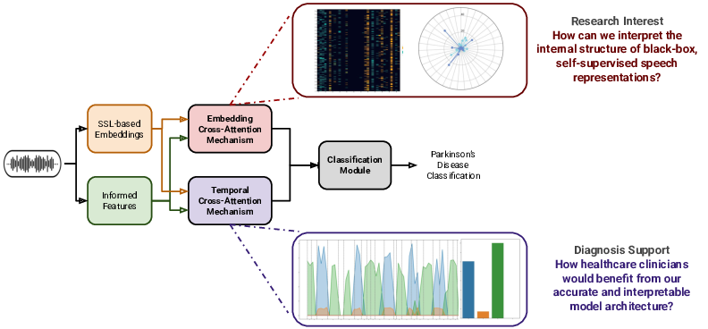

<h1 align="center"><span style="font-weight:normal">Unveiling Interpretability in Self-Supervised Speech Representations for Parkinson’s Diagnosis 🗣️🎙️📝📊</h1>
  
<div align="center">
  
[D. Gimeno-Gómez](https://scholar.google.es/citations?user=DVRSla8AAAAJ&hl=en), [C. Botelho](https://scholar.google.com/citations?user=d-xmVlUAAAAJ&hl=en), [A. Pompili](https://scholar.google.pt/citations?user=ZiB_o6kAAAAJ&hl=en), [A. Abad](https://scholar.google.pt/citations?user=M5hzAIwAAAAJ&hl=en), [C.-D. Martínez-Hinarejos](https://scholar.google.es/citations?user=HFKXPH8AAAAJ&hl=en)
</div>

<div align="center">
  
[📘 Introduction](#intro) |
[🛠️ Data Preparation](#preparation) |
[🚀 Training and Evaluation](#training) |
[📖 Citation](#citation) |
[📝 License](#license)
</div>

## <a name="intro"></a> 📘 Introduction

<div align="center">  </div>

**Abstract.** _Recent works in pathological speech analysis have increasingly relied on powerful self-supervised speech representations, leading to promising results. However, the complex, black-box nature of these embeddings and the limited research on their interpretability significantly restrict their adoption for clinical diagnosis. To address this gap, we propose a novel, interpretable framework specifically designed to support Parkinson’s Disease (PD) diagnosis. Through the design of simple yet effective cross-attention mechanisms for both embedding- and temporal-level
analysis, the proposed framework offers interpretability from two distinct but complementary perspectives. Experimental findings across five well-established speech benchmarks for PD detection demonstrate the framework’s capability to identify meaningful speech patterns within self-supervised representations for a wide range of assessment tasks. Fine-grained temporal analyses further underscore its potential to enhance the interpretability
of deep-learning pathological speech models, paving the way for the development of more transparent, trustworthy, and clinically applicable computer-assisted diagnosis systems in this domain. Moreover, in terms of classification accuracy, our method achieves results competitive with state-of-the-art approaches, while also demonstrating robustness in cross-lingual scenarios when applied to spontaneous speech production._ [📜 Arxiv Link](https://arxiv.org/abs/2412.02006) [📜 IEEE Link](https://ieeexplore.ieee.org/abstract/document/10877763)

## <a name="preparation"></a> 🛠️ Preparation

- Prepare the **conda environment** to run the experiments:

```
conda create -n ssl-parkinson python=3.10
conda activate ssl-parkinson
pip install -r requirements.txt
```

## <a name="training"></a> 🚀 Training and Evaluation

To train and evaluate our proposed framework, we should follow a pipeline consisting of multiple steps, including data preprocessing, dataset split, feature extraction, as well as the ultimate training and evaluation. As an example, we provide the scripts aimed to address our GITA corpus experiments:

```
bash scripts/run/dataset_preparation/gita.sh $DATASET_DIR $METADATA_PATH
bash scripts/run/feature_extraction/gita.sh
bash scripts/run/experiments/cross_full/gita.sh
```

, where `$DATASET_DIR` and `$METADATA_PATH` refer to the directory containing all the audio waveform samples and the CSV including the corpus subject metadata, respectively.

## <a name="citation"></a> 📖 Citation

The paper is currently under review for the Special Issue on Modelling and Processing Language and Speech in Neurodegenerative Disorders published by Journal of Selected Topics in Signal Processing (JSTSP). For the moment, if you found useful our work, please cite our preprint paper as follows:

```
@article{gimeno2025unveiling,
  author={Gimeno-G{\'o}mez, David and Botelho, Catarina and Pompili, Anna and Abad, Alberto and Martínez-Hinarejos, Carlos-D.},
  title={{Unveiling Interpretability in Self-Supervised Speech Representations for Parkinson’s Diagnosis}},
  journal={IEEE Journal of Selected Topics in Signal Processing},
  volume={},
  pages={1--14}
  year={2025},
  doi={10.1109/JSTSP.2025.3539845},
}
```

## <a name="license"></a> 📝 License

This work is protected by [MIT License](LICENSE)
