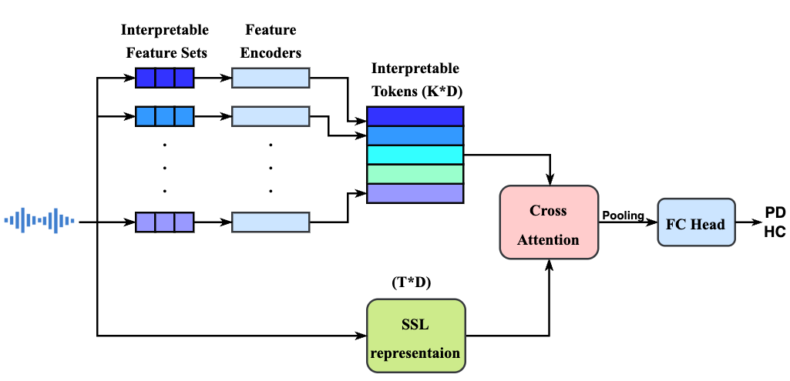

<h1 align="center"><span style="font-weight:normal">RECA-PD: A Robust Explainable Cross-Attention Method for Speech-based Parkinson's Disease Classification</h1>
  
<div align="center">
  
[Terry Yi Zhong](https://terryyizhong.github.io/)
</div>

<div align="center">
  
[📘 Introduction](#intro) |
[🛠️ Data Preparation](#preparation) |
[🚀 Training and Evaluation](#training) |
[📖 Citation](#citation) |
[📝 License](#license)
</div>

## <a name="intro"></a> 📘 Introduction

<div align="center">  </div>

**Abstract.** _Parkinson's Disease (PD) affects over 10 million people globally, with speech impairments often preceding motor symptoms by years, making speech a valuable modality for early, non-invasive detection. While recent deep-learning models achieve high accuracy, they typically lack the explainability required for clinical use. To address this, we propose RECA-PD, a novel, robust, and explainable cross-attention architecture that combines interpretable speech features with self-supervised representations. RECA-PD matches state-of-the-art performance in Parkinson’s disease detection while providing explanations that are more consistent and more clinically meaningful. Additionally, we demonstrate that performance degradation in certain speech tasks (e.g., monologue) can be mitigated by segmenting long recordings. Our findings indicate that performance and explainability are not necessarily mutually exclusive. Future work will enhance the usability of explanations for non-experts and explore severity estimation to increase the real-world clinical relevance._ [📜 Arxiv Link](https://arxiv.org/abs/) [📜 TSD 2025 Link]()

## <a name="environment"></a> 🛠️ Environment

- Prepare the **conda environment** to run the experiments:

```
conda create -n ssl-parkinson python=3.10
conda activate ssl-parkinson
pip install -r requirements.txt
```

## <a name="preparation"></a> 🚀 Preparation

Data preprocessing, dataset split, feature extraction scripts. As an example, we provide the scripts aimed to address our GITA corpus experiments:

```
bash scripts/runs/dataset_preparation/gita.sh $DATASET_DIR $METADATA_PATH
bash scripts/runs/feature_extraction/gita.sh
```

, where `$DATASET_DIR` and `$METADATA_PATH` refer to the directory containing all the audio waveform samples and the CSV including the corpus subject metadata, respectively. _Please, note that you have to convert the 1st sheet of the .xlsx provided in the GITA dataset to a .csv file._

We also include the scripts used to generate the split-mono training set described in the paper. To train and test on this set:
	1.	Follow the instructions in splits/gita-splitmono/README.md to generate the new audio segments.
	2.	Update the folder paths in the scripts above to point to your newly created segments so you can extract the corresponding features.

Note that, to keep the overall pipeline straightforward, the split-mono task is not integrated into the scripts of Evaluation Protocol 1 introduced below.

## <a name="training and evaluation"></a> 🚀 Training and Evaluation


We evaluate four methods (M1–M4) under two protocols as introduced in the paper.  
Here, we show the scripts for the proposed method (RECA-PD); the other methods follow the same procedure within their respective folders.

Generated splits for both protocols are available under:
- `splits/gita_splits1/`
- `splits/gita_splits2/`

---

## Training

All training scripts are located in:  
- `scripts/runs/experiments/training/protocol1/`  
- `scripts/runs/experiments/training/protocol2/`  

To train each method, run the corresponding shell script:

| Method                         | Script                               |
|--------------------------------|--------------------------------------|
| **M1 (Base)**                  | `gita_base_M1.sh`                    |
| **M2 (M1 + Fixed Softmax)**         | `gita_fix_softmax_M2.sh`             |
| **M3 (M2 + InterpretableValue)**   | `gita_fix_interpretableValue_M3.sh`  |
| **M4 (RECA-PD, proposed)**     | `gita_RECAPD_M4.sh`                  |


Evaluation:

In order to **evaluate your model** for a specific assessment task across all repetitions and folds, you can run the following command:

```
python scripts/evaluation/overall_performance.py --exps-dir ./exps/gita/cross_full/$TASK/
```

, where `$TASK` corresponds to the name of the target task you want to evaluate. You can always inspect the directory `scripts/evaluation/` to find other interesting scripts.


A simple Visualization notebook:


## <a name="citation"></a> 📖 Citation


